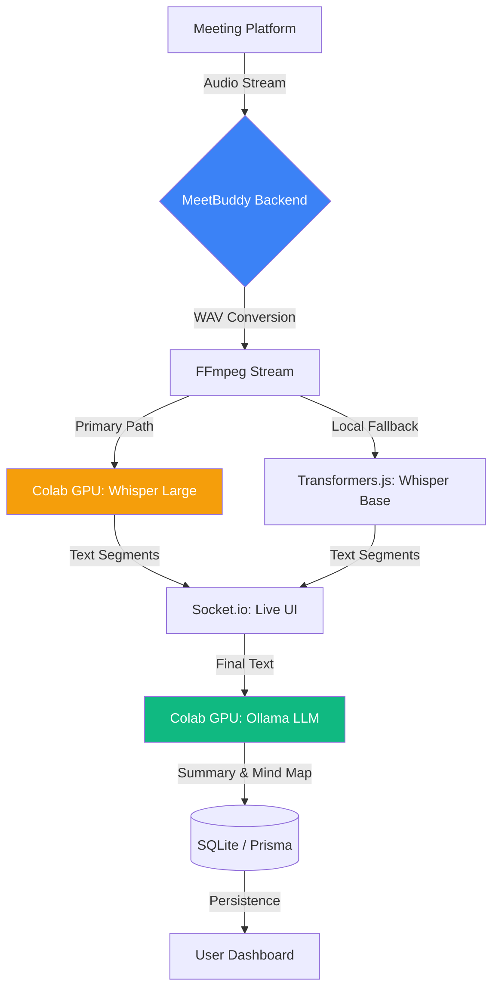

# <p align="center">🎙️ MeetBuddy AI</p>

<p align="center">
  <strong>The Intelligent Assistant for Seamless Video Conferencing</strong>
</p>

<p align="center">
  
  
  
  
</p>

<p align="center">
  <video src="https://github.com/G1r1dhar/MeetBuddy-AI/raw/main/meetbuddyai_12_03_26.mp4" controls width="100%"></video>
</p>

---

## ✨ Key Features

### 🤖 Advanced AI Intelligence
- **GPU-Accelerated LLM**: Generate meeting summaries, key points, action items, and mind maps using **Ollama** running on free Colab GPU instances.
- **Smart Insights**: Automatically identifies topics, hierarchical mind maps, and next steps based on meeting context.

### 🎙️ Advanced Transcription
- **Hybrid Engine**: Seamlessly switches between high-accuracy **Whisper Large (Colab/GPU)** and efficient **Whisper Base (Local)**.
- **Privacy First**: Audio is processed locally/privately using **Transformers.js**, ensuring your data never leaves your infrastructure unless manually offloaded to GPU.
- **Speaker Identification**: Clearly distinguish contributors with real-time confidence scoring.

---

## 🏗️ Architecture & Workflow



---

## 🚀 Tech Stack

| Component | Technology | Role |
| :--- | :--- | :--- |
| **Frontend** | React 18 / Vite / Tailwind / Framer Motion | Modern UI, Styling & Animations |
| **Backend** | Node.js / Express | Robust API & Orchestration |
| **Real-Time** | Socket.io | Bi-directional Live Streaming |
| **Database** | SQLite / Prisma | Lightweight & Reliable Storage |
| **Transcription** | Transformers.js | **Whisper-Base.en** (Local) |
| **GPU Backend** | FastAPI / Colab | **Whisper-Large-v3** & **Ollama** |
| **Summarization & Mind Maps** | Ollama | **Llama / Mistral** (Cloud) |
| **Audio Ops** | FFmpeg | Format conversion & Resampling |

---

## 🛠️ Getting Started

### Prerequisites
- **Node.js**: v18.0+
- **FFmpeg**: Required for audio processing (baked into project via `ffmpeg-static`)
- **Memory**: 8GB+ (Recommended for local model inference)

### Installation

1. **Clone & Explore**
   ```bash
   git clone https://github.com/G1r1dhar/MeetBuddy-AI.git
   cd MeetBuddy-AI
   ```

2. **Setup Environments**
   ```bash
   # Add your DB URL and optional Colab URL
   cp .env.example .env
   ```

3. **Database Migration**
   ```bash
   cd backend
   npx prisma db push
   ```

4. **Install & Launch**
   ```bash
   # From root
   npm run dev
   ```


---

## 🔒 Security & Contribution

- **Enterprise Security**: JWT-based auth, encrypted storage, and robust environment management.
- **Contribution**: We love PRs! Please check out [CONTRIBUTING.md](./CONTRIBUTING.md) and our [SECURITY.md](./SECURITY.md) guidelines.

---

## 👨‍💻 Author

**Bhaikar Giridhar**  
📧 [giridhar2k20@gmail.com](mailto:giridhar2k20@gmail.com)  
🔗 [GitHub Profile](https://github.com/G1r1dhar)

---

<p align="center">
  MADE WITH ❤️ BY THE MEETBUDDY AI TEAM
</p>
