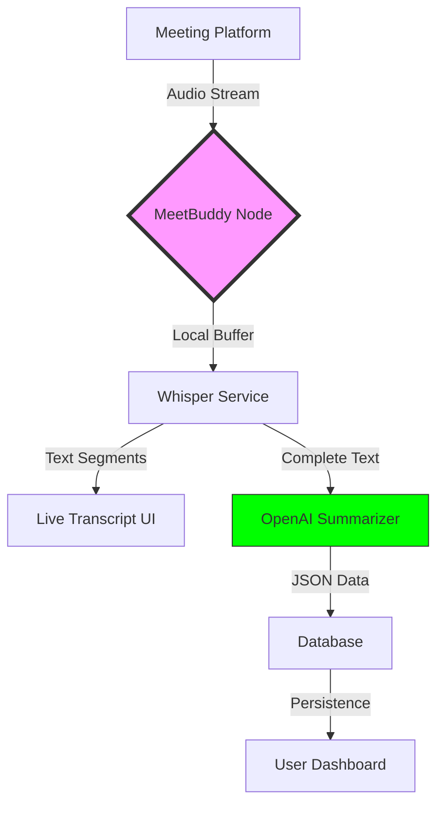

# <p align="center">🎙️ MeetBuddy AI</p>

<p align="center">
  <strong>The Intelligent Assistant for Seamless Video Conferencing</strong>
</p>

<p align="center">
  
  
  
  
</p>

---

## 🌟 Overview

**MeetBuddy AI** is a cutting-edge, full-stack application designed to transform your meeting productivity. By integrating with major platforms like **Google Meet, Zoom, and Microsoft Teams**, it captures high-fidelity live transcripts and uses advanced AI to distill them into actionable summaries and insights.

---

## ✨ Key Features

### 🤖 AI-Powered Intelligence
- **Smart Summarization**: Automatically generate executive summaries, key decisions, and action items using OpenAI's GPT models.
- **Mind Map Generation**: Visualize meeting connections and topic flow.

### 🎙️ Advanced Transcription
- **Whisper Integration**: High-accuracy local and cloud-based transcription using OpenAI's Whisper models.
- **Speaker Identification**: Clearly distinguish who said what throughout the session.
- **Confidence Scoring**: Real-time feedback on transcription accuracy.

### 📊 Professional Management
- **Centralized Dashboard**: A "single pane of glass" for all your past and live meetings.
- **Admin Analytics**: Comprehensive monitoring of system usage, transcription volume, and user activity.
- **Search & Filter**: Find exactly what was said months ago in seconds.

---

## 🏗️ Architecture & Workflow



---

## 🚀 Tech Stack

| Frontend | Backend | AI & Infrastructure |
| :--- | :--- | :--- |
| **React 18** (TS) | **Node.js** (Express) | **OpenAI API** |
| **Vite** | **TypeScript** | **Whisper (Local/Colab)** |
| **Tailwind CSS** | **PostgreSQL** (Prisma) | **Socket.io** |
| **React Query** | **Redis** | **Docker** |

---

## 🛠️ Getting Started

### Prerequisites
- **Node.js**: v18.0 or higher
- **Database**: PostgreSQL
- **Caching**: Redis
- **API Keys**: OpenAI API Key (for summarization)

### Installation

1. **Clone & Explore**
   ```bash
   git clone https://github.com/G1r1dhar/MeetBuddy-AI.git
   cd MeetBuddy-AI
   ```

2. **Setup Environments**
   ```bash
   # Root directory
   cp .env.example .env
   # Backend directory
   cd backend && cp .env.example .env
   ```

3. **Install Dependencies**
   ```bash
   # For Frontend
   npm install
   # For Backend
   cd backend && npm install
   ```

4. **Launch Development**
   ```bash
   # Run both Frontend and Backend
   npm run dev
   ```

---

## 🔒 Security & Contribution

- **Enterprise Security**: JWT-based auth, encrypted storage, and robust environment management.
- **Contribution**: We love PRs! Please check out [CONTRIBUTING.md](./CONTRIBUTING.md) and our [SECURITY.md](./SECURITY.md) guidelines.

---

## 👨‍💻 Author

**Bhaikar Giridhar**  
📧 [giridhar2k20@gmail.com](mailto:giridhar2k20@gmail.com)  
🔗 [GitHub Profile](https://github.com/G1r1dhar)

---

<p align="center">
  MADE WITH ❤️ BY THE MEETBUDDY AI TEAM
</p>
